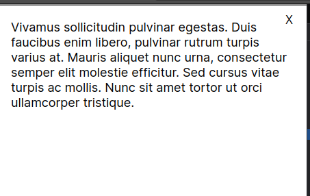
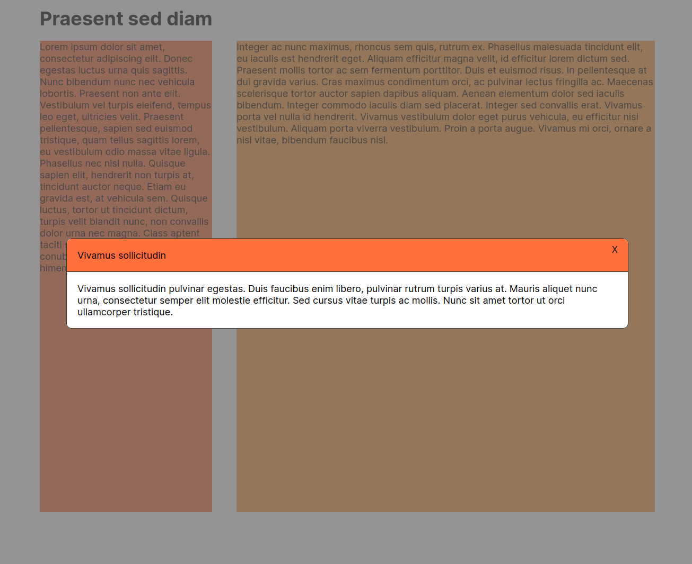

# Modal Window

## Stage 1

To conduct this test, create a zip of the `exercise` folder and send it to the candidate. The candidate can find the instructions in the `README.md` file.

The instructions are intentionally vague. We expect the candidate to ask things like:

- What size should the modal be? - A width of 80% will do
- Should it be responsive? - Start not responsive. We can make it responsive if we have time
- How do we close it? - Clicking outside of the modal or clicking the X should close the modal

We don't expect the candidate to match exactly the screenshot, but they should be able to use a transparent background so the page behind the modal can be seen. We also want the modal to have rounded corners and a border.

## Stage 2

This stage consists of making the modal responsive.

It should occupy the whole screen for small screens (600px width):



## Stage 3

The last stage consists on making it possible to pass a title to the modal:

```
<MyModal>
  <MyModal.Header>Some header</MyModal.Header>
  <MyModal.Body>Some body</MyModal.Body>
</MyModal>
```

The result should look like this when there is a title:



If there is no title given to the modal, it should render as it previously did.

## Evaluation

Don't expect the candidate to finish all stages. A recommended way to evaluate:

- Stage 1 not finished - No hire
- Stage 1 finished - Weak hire
- Stage 2 finished - Hire
- Stage 3 finished - Strong hire
